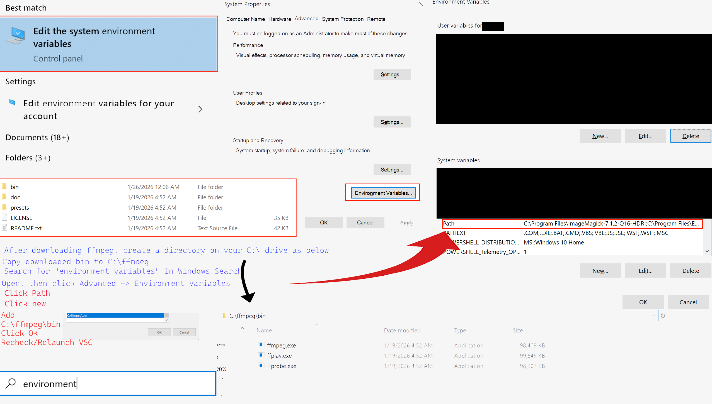
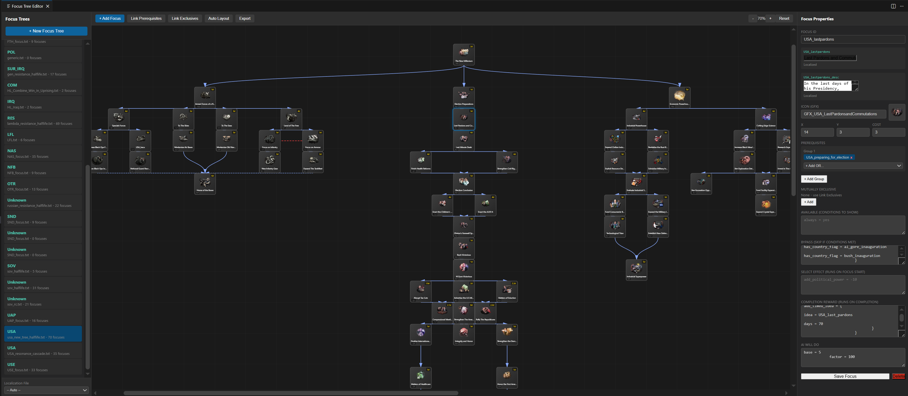

# HOI4 Modding Tools Extension





# HOI4 Modding Tools

A new Visual Studio Code extension for Hearts of Iron IV mod development, focused on ease of use, orchestration, and assisting the mod community and mod teams with a modern HOI4 modding toolset with multiple functions and uses.

# HOI4 Modding Tools for VS Code

A comprehensive Visual Studio Code extension for Hearts of Iron IV mod development. This extension provides a complete suite of visual editors, analyzers, and productivity tools for creating professional HOI4 mods.


---

## Table of Contents

- [Installation](#installation)
- [Quick Start](#quick-start)
- [Visual Editors](#visual-editors)
- [Analysis Tools](#analysis-tools)
- [Content Browsers](#content-browsers)
- [Graphics Tools](#graphics-tools)
- [Localization Tools](#localization-tools)
- [Development Tools](#development-tools)
- [Search and Navigation](#search-and-navigation)
- [Keyboard Shortcuts](#keyboard-shortcuts)
- [Configuration](#configuration)
- [Troubleshooting](#troubleshooting)
- [Contributing](#contributing)

---

## Installation

### From VSIX File (Recommended)

1. Download the latest `.vsix` file from [Releases](https://github.com/your-repo/hoi4-modding-tools/releases)
2. Open VS Code
3. Press `Ctrl+Shift+P` and type **Install from VSIX**
4. Select the downloaded file
5. Reload VS Code when prompted


---

## Quick Start

1. **Open your mod folder** in VS Code (File > Open Folder)
2. Look for the **Shield icon** in the Activity Bar (left sidebar)
3. Click it to reveal all tools organized by category
4. Start with **Welcome / Help** for an interactive guide

---

## Visual Editors

### Focus Tree Editor

**Command:** `HOI4: Focus Tree Editor`

A full visual editor for creating and modifying national focus trees with drag-and-drop functionality.

#### Opening the Editor

1. Click **Focus Tree Editor** in the sidebar, or
2. Press `Ctrl+Shift+P` and type "Focus Tree Editor"

#### Main Interface

- **Left Sidebar:** List of all focus trees in your mod
- **Center Canvas:** Visual focus tree with draggable nodes
- **Right Panel:** Property editor for selected focus

#### Creating a New Focus Tree

1. Click the **+ New Tree** button
2. Enter country tag (e.g., `GER`, `ENG`)
3. Enter tree name
4. Click Create

#### Adding Focuses

- Click **Add Focus** in toolbar, or
- Right-click on canvas and select "Add Focus Here", or
- Press **A** key to add at center

#### Editing Focus Properties

1. Click a focus node to select it
2. Edit properties in right panel:
   - **Focus ID:** Internal identifier
   - **Name/Description:** Click to edit localization
   - **Icon:** GFX sprite name (with preview)
   - **X/Y Position:** Grid coordinates
   - **Cost:** Days to complete
   - **Prerequisites:** Required focuses (AND groups, OR within groups)
   - **Mutually Exclusive:** Blocking focuses
   - **Available/Bypass:** Trigger conditions
   - **Completion Reward:** Effects on completion
   - **AI Will Do:** AI weighting

#### Moving Focuses

- Drag and drop focus nodes to reposition
- Position snaps to grid automatically
- Connections update in real-time

#### Linking Prerequisites

1. Click **Link Prerequisites** button or press **P**
2. Click the **parent** focus first
3. Click the **child** focus
4. Repeat for more connections
5. Press **Escape** to exit link mode

For OR prerequisites (any one required), add multiple focuses to the same prerequisite group using the dropdown in the editor.

#### Linking Mutual Exclusives

1. Click **Link Exclusives** button or press **M**
2. Click first focus
3. Click second focus
4. Both focuses will block each other

#### Focus Tree Keyboard Shortcuts

| Key | Action |
|-----|--------|
| A | Add focus at center |
| P | Toggle prerequisite linking mode |
| M | Toggle exclusive linking mode |
| Delete | Delete selected focus |
| Escape | Cancel current operation |

#### Tips

- Focus positions use HOI4's grid system (each unit = 1 column/row)
- Focuses with `relative_position_id` show calculated absolute positions
- Double-click a focus to quickly edit its name
- Use the zoom controls for large trees

---

### Decision Editor

**Command:** `HOI4: Decision Editor`

Visual editor for creating and managing decisions with full support for all decision types.

#### Decision Types Supported (Work in Progress)

- **Standard Decisions:** Instant effect on activation
- **Timed Decisions:** Effect after countdown
- **Timed Missions:** AI-triggered with timeout
- **Selectable Missions:** Player-chosen missions

#### Main Interface

- **Left Sidebar:** File browser and decision list
- **Center Panel:** Decision list with categories
- **Right Panel:** Full property editor

#### Creating Decisions from Template

1. Click **Templates** button
2. Choose a template:
   - War Goal Decision
   - Political Action
   - Timed Mission
   - Economic Decision
   - State Action
   - Faction Interaction
3. Select target category
4. Click "Create from Template"

#### Manual Creation

1. Click **+ Add** button
2. Select decision type
3. Select category
4. Edit properties in right panel

#### Editing Decisions

Select a decision to edit:

- **Basic Info:** ID, name, description, icon, category
- **Cost and Timing:** PP cost, days, re-enable delay
- **Conditions:** Allowed, Available, Visible triggers
- **Targets:** Fixed targets, target array, state targeting
- **Effects:** Complete, Remove, Timeout, Cancel effects
- **AI:** AI weighting and conditions

#### Icon Browser

1. Click **Browse...** next to Icon field
2. Search or scroll through available GFX sprites
3. Click to preview, double-click to select

#### State Picker

For `highlight_states`:

1. Click **Pick States...** button
2. Search by ID or name
3. Click states to select (multi-select)
4. Click "Apply" to insert state list

#### In-Game Preview

Click **Preview** to see how the decision appears in-game UI, including icon display, name and description, cost and duration, and category placement.

#### Validation

- Click **Validate** to check for errors
- Automatic validation on save
- Shows missing localizations, invalid references

#### Search Across Files

1. Click **Search All** button
2. Enter search term
3. Filter by type (flags, events, ideas, states)
4. Click results to jump to that decision

---

### Tech Tree Editor

**Command:** `HOI4: Tech Tree Editor`

Visual editor for technology trees with research time calculations.

#### Features

- Visual tech tree layout matching in-game view
- Drag-and-drop positioning
- Research time and cost editing
- Prerequisite linking
- Category management
- Icon preview

#### Usage

1. Select a technology file
2. Click technologies to edit properties
3. Drag to reposition
4. Link prerequisites by clicking connection mode

#### Technology Properties

- Research time and cost
- Start year
- Categories and folders
- Prerequisites
- Research bonuses
- Unlocked equipment/units

---

### Map Editor

**Command:** `HOI4: Open Map Editor`

Visual map editor for provinces, states, and strategic regions.

#### Map Layers

- **Provinces:** Individual province view
- **States:** State boundaries and ownership
- **Strategic Regions:** Military regions
- **Supply Areas:** Logistics visualization

#### Province Picker

1. Open Map Editor
2. Click on map to select province
3. Province ID shown in status bar
4. Copy ID with button or `Ctrl+C`

#### State Editing

Click state to select, then edit properties in side panel:

- Owner and controller
- Victory points
- Buildings (infrastructure, factories, etc.)
- Resources (steel, oil, etc.)
- Core states

#### Building Placement

- Click building icons to place
- Adjust levels with +/- buttons
- Visual indicators on map

---

### OOB Creator

**Command:** `HOI4: OOB Creator`

Create Orders of Battle (starting military units) for countries.

#### Creating an OOB

1. Click **New OOB** or select existing
2. Set country tag
3. Build military hierarchy

#### Unit Hierarchy

- **Theater** > Army Group > Army > Corps > Division
- Drag units to reorganize
- Right-click for context menu

#### Division Designer

1. Click **New Division**
2. Select division template or create custom
3. Add battalions: Infantry, Artillery, Armor, Support companies
4. Set equipment levels
5. Assign to army/corps

#### Air Wings

- Create air wings
- Assign aircraft types and counts
- Set home air base

#### Naval Fleets

- Create task forces
- Assign ships
- Set home port

#### Export

- Generates valid HOI4 OOB file
- Automatically creates unit history file
- Proper formatting and structure

---

## Analysis Tools

### Equipment Analyzer

**Command:** `HOI4: Equipment Analyzer`

Analyze, compare, and simulate production of equipment.

#### Equipment Browser

- Browse all equipment by category
- Filter by year, type, archetype
- View detailed stats

#### Equipment Editor

1. Select equipment to edit
2. Modify any stat
3. See combat preview update
4. Save to original file

#### Production Simulator

1. Select equipment
2. Set factory count
3. Apply modifiers (industrial capacity, production efficiency, resource availability)
4. View production rate and time estimates

#### Comparison Mode

- Select up to 3 equipment items
- Side-by-side stat comparison
- Highlights best/worst values
- Cost efficiency analysis

---

### Battle Simulator

**Command:** `HOI4: Battle Simulator`

Simulate combat between divisions to test effectiveness.

#### Setting Up a Battle

1. **Attacker:** Build or select division
2. **Defender:** Build or select division
3. **Terrain:** Select combat terrain
4. **Modifiers:** Add entrenchment, air support, etc.

#### Division Builder

- Add any unit types
- Set equipment variants
- Apply doctrines and modifiers

#### Combat Stats

- Soft/Hard Attack values
- Defense and Breakthrough
- Organization and HP
- Armor and Piercing

#### Simulation Results

- Predicted winner
- Estimated battle duration
- Casualty estimates
- Organization damage over time

---

### AI Behavior Viewer

**Command:** `HOI4: AI Behavior`

Analyze and understand AI decision-making in your mod.

#### Features

- View AI strategy plans
- Analyze focus tree AI weights
- See decision AI priorities
- Understand AI division templates

#### Usage

1. Select country or AI file
2. Browse AI behaviors by type
3. View conditions and weights
4. Identify potential issues

---

### Event Chain Visualizer

**Command:** `HOI4: Event Chain Visualizer`

Visualize event relationships and chains.

#### Features

- Interactive graph view
- Automatic chain detection
- Option tracking
- Namespace filtering

#### Usage

1. Open Event Chain Visualizer
2. Select event namespace or file
3. View connected events as graph
4. Click nodes to see event details
5. Follow option arrows to see triggers

#### Graph Controls

- Zoom with scroll wheel
- Pan by dragging background
- Click nodes to select
- Double-click to open event file

---

### Dependency Graph

**Command:** `HOI4: Show Dependency Graph`

**Shortcut:** `Ctrl+Alt+D`

Visualize relationships between files in your mod.

#### Features

- File dependency visualization
- Circular dependency detection
- Impact analysis
- Filter by file type

#### Usage

1. Open from sidebar or command
2. Select root file or view all
3. Explore connections
4. Click nodes to see details

#### Impact Analysis

Right-click any file and select "Analyze Impact" to see:

- What files depend on this file
- What this file depends on
- Potential cascade effects of changes

---

## Content Browsers

### Idea Browser

**Command:** `HOI4: Idea Browser`

Browse and search all ideas, national spirits, and advisors.

#### Categories

- National Spirits
- Political Advisors
- Military Advisors (Army, Navy, Air)
- Theorists
- Laws (Economy, Trade, Conscription)
- Hidden Ideas

#### Features

- Search by name or effect
- Filter by category
- View all modifiers
- See availability conditions
- Cost information

#### Usage

1. Open Idea Browser
2. Select category or search
3. Click idea to see details
4. Double-click to open source file

---

### Flag and Variable Tracker

**Command:** `HOI4: Flag Tracker`

Track global flags, country flags, and variables across your mod.

#### Features

- Find all flag/variable definitions
- Track where flags are set
- Track where flags are checked
- Identify unused flags

#### Flag Types

- Global flags
- Country flags
- State flags
- Variables
- Dynamic modifiers

#### Usage

1. Open Flag Tracker
2. Search for flag name
3. View all references
4. Click to jump to location

---

## Graphics Tools

### GFX Auditor

**Command:** `HOI4: GFX Auditor`

Validate and manage graphical assets.

#### Audit Types

- **Missing Assets:** GFX defined but file missing
- **Unused Assets:** Files with no GFX reference
- **Invalid Dimensions:** Wrong image sizes
- **Format Issues:** Incorrect file formats

#### Usage

1. Open GFX Auditor
2. Run audit (automatic on open)
3. Review issues by category
4. Click to navigate to problem
5. Use Quick Fix for common issues

#### Quick Fixes

- Generate missing GFX entries
- Create placeholder images
- Fix path references

---

### Image Toolkit

**Command:** `HOI4: Image Toolkit`

Image processing and conversion tools.

#### Features

- View DDS files directly
- Convert between formats (DDS, PNG, TGA)
- Resize images
- Generate mipmaps
- Batch processing

#### Supported Formats

- DDS (DXT1, DXT5, BC7)
- PNG
- TGA
- BMP

---

### Event Picture Creator

**Command:** `HOI4: Event Picture Creator`

Create and manage event pictures.

#### Features

- Browse existing event pictures
- Create new event GFX entries
- Preview at correct dimensions
- Auto-generate sprite definitions

#### Usage

1. Open Event Picture Creator
2. Browse or create new
3. Select source image
4. Set GFX name
5. Generate entry and copy files

---

### Animated DDS Viewer

**Command:** `HOI4: Animated DDS`

View animated DDS files used in HOI4.

#### Features

- Play animated textures
- Frame-by-frame view
- Speed controls
- Export frames

---

## Localization Tools

### Localization Dashboard

**Command:** `HOI4: Localization Dashboard`

**Shortcut:** `Ctrl+Alt+L`

Overview of localization coverage and management.

#### Features

- Coverage statistics by category
- Missing key detection
- Language comparison
- Batch operations

#### Dashboard Views

- **Overview:** Total coverage percentage
- **By File:** Coverage per localization file
- **Missing:** List of unlocalized keys
- **Comparison:** Compare languages

#### Batch Operations

- Add multiple keys at once
- Copy from one language to another
- Export missing keys list

---

### Event Localizer

**Command:** `HOI4: Event Localizer`

Quickly localize events with assisted suggestions.

#### Features

- Event-focused localization
- Title and description editing
- Option text management
- Preview formatted text

#### Usage

1. Open Event Localizer
2. Select event file
3. Edit titles, descriptions, options
4. Save to localization file

---

### Quick Localize

**Shortcut:** `Ctrl+Shift+L`

Instantly add localization for selected text.

#### Usage

1. Select a localization key in your code (e.g., `my_event.1.t`)
2. Press `Ctrl+Shift+L`
3. Enter the localized text
4. Automatically added to your localization file

#### Configuration

Set your default localization file in settings:

```json
{
  "hoi4.localizationFile": "localisation/mymod_l_english.yml"
}
```

---

## Development Tools

### Dev Notes and Kanban

**Command:** `HOI4: Dev Notes`

Project management integrated into your mod workspace.

#### Kanban Board

- Drag-and-drop task management
- Customizable columns
- Card labels and due dates
- Rich text descriptions

#### File Notes

- Attach notes to specific files
- Quick access from explorer
- Color-coded by priority

#### TODO Scanner

Automatically finds comments:

- `// TODO: ...`
- `// FIXME: ...`
- `// NOTE: ...`
- `# ISSUE: ...`

#### Data Storage

- Saved to `.hoi4-dev-notes.json`
- Add to `.gitignore` if desired
- Share via version control

---

### Performance Profiler

**Command:** `HOI4: Performance Profiler`

**Shortcut:** `Ctrl+Alt+P`

Analyze mod performance and find bottlenecks.

#### Metrics Analyzed

- File size analysis
- Trigger complexity scoring
- Effect chain depth
- Event fire frequency estimates

#### Reports

- **Large Files:** Files that may cause loading issues
- **Complex Triggers:** Expensive condition checks
- **Heavy Effects:** Resource-intensive effects
- **Recommendations:** Optimization suggestions

#### Usage

1. Open Performance Profiler
2. Run analysis
3. Review issues by severity
4. Click items to navigate
5. Follow recommendations

---

### Debug Log Viewer

**Command:** `HOI4: Show Debug Log`

**Shortcut:** `Ctrl+Alt+O`

View and analyze HOI4's debug output.

#### Features

- Live log tailing
- Error highlighting (red)
- Warning highlighting (yellow)
- Filter by type
- Search functionality
- Click errors to open source

#### Log Watcher

Start continuous monitoring:

1. `HOI4: Start Debug Log Watcher`
2. Run the game
3. Errors appear in real-time
4. `HOI4: Stop Debug Log Watcher` when done

#### Configuration

Set your log path:

```json
{
  "hoi4.debugLogPath": "C:/Users/You/Documents/Paradox Interactive/Hearts of Iron IV/logs"
}
```

---

### Changelog Generator

**Command:** `HOI4: Changelog Generator`

Generate changelogs from git history.

#### Features

- Reads git commits automatically
- Auto-categorizes changes
- Version tagging
- Markdown export
- Custom templates

#### Categories

- Features
- Bug Fixes
- Balance Changes
- Content Additions
- Performance

#### Usage

1. Open Changelog Generator
2. Select date range or version tags
3. Review and edit entries
4. Export as Markdown
5. Ready for Steam/GitHub

---

## Search and Navigation

### Global Search

**Command:** `HOI4: Global Search`

**Shortcut:** `Ctrl+Alt+G`

Search across all mod content.

### Specialized Searches

| Command | Shortcut | Searches |
|---------|----------|----------|
| Search Flags | `Ctrl+Shift+F` | Country flags, global flags |
| Search Events | - | Event IDs and content |
| Search Focus | - | Focus tree IDs and effects |
| Search Decisions | - | Decision IDs and triggers |

### Go to Definition

**Shortcut:** `F12`

Jump to the definition of event IDs, focus IDs, decision IDs, idea IDs, and technology IDs.

### Find All References

**Shortcut:** `Shift+F12`

Find everywhere something is used.	

---

## Keyboard Shortcuts

| Shortcut | Action |
|----------|--------|
| `Ctrl+Shift+L` | Quick Localize selected text | (Or select text and right click and click HOI4: Add Dev Note Here)
| `Ctrl+Alt+G` | Global Search |
| `Ctrl+Alt+D` | Dependency Graph |
| `Ctrl+Alt+P` | Performance Profiler |
| `Ctrl+Alt+L` | Localization Dashboard |
| `Ctrl+Alt+O` | Debug Log Viewer | Or click Problems by Output on the bottom menu pane
| `Ctrl+Shift+I` | Analyze Impact |
| `F12` | Go to Definition |
| `Shift+F12` | Find All References |
| `Ctrl+Space` | IntelliSense suggestions |
| `Ctrl+.` | Quick Fix menu |

---

## Configuration

### Extension Settings

Access via **File > Preferences > Settings** and search for "HOI4" or edit the Extension Settings Workspace.

```json
{
  "hoi4.gamePath": "C:/Program Files/Steam/steamapps/common/Hearts of Iron IV",
  "hoi4.defaultLanguage": "english",
  "hoi4.localizationFile": "localisation/mymod_l_english.yml",
  "hoi4.enableDiagnostics": true,
  "hoi4.debugLogPath": "Documents/Paradox Interactive/Hearts of Iron IV/logs"
}
```

### Workspace Settings

Create `.vscode/settings.json` in your mod folder for project-specific settings:

```json
{
  "hoi4.modName": "My Awesome Mod",
  "hoi4.modVersion": "1.0.0",
  "hoi4.supportedGameVersion": "1.14.*"
}
```

---

## Troubleshooting

### Extension Not Loading

1. Ensure you opened a **folder**, not individual files
2. Check for `descriptor.mod` in root (identifies HOI4 mod)
3. Reload VS Code: `Ctrl+Shift+P` > "Reload Window"
4. Check Output panel for errors: View > Output > "HOI4 Modding Tools"

### Map Editor Issues

- Verify `map/definition.csv` exists
- Ensure `map/provinces.bmp` is valid
- Check file permissions

### Localization Not Working

1. Set localization file in settings
2. Ensure file uses **UTF-8-BOM** encoding
3. Verify file path is correct relative to workspace

### Focus Tree Not Displaying Correctly

- Check for circular `relative_position_id` references
- Verify all referenced focuses exist
- Save and reload the tree

### Performance Issues

1. Large mods take time to index on first open
2. Close unused editor panels
3. Disable unused features in settings
4. Rebuild index: `HOI4: Rebuild File Index`

---

## Expected Mod Structure

```
your-mod/
├── common/
│   ├── countries/
│   ├── country_tags/
│   ├── decisions/
│   │   └── categories/
│   ├── ideas/
│   ├── national_focus/
│   ├── technologies/
│   └── units/
│       └── equipment/
├── events/
├── gfx/
│   ├── event_pictures/
│   ├── interface/
│   │   └── goals/
│   └── leaders/
├── history/
│   ├── countries/
│   ├── states/
│   └── units/
├── interface/
├── localisation/
├── map/
│   ├── definition.csv
│   └── provinces.bmp
└── descriptor.mod
```

---

### Reporting Issues

1. Message awesome___. aka Olander on Discord


## Acknowledgments

- Hearts of Iron IV by Paradox Interactive
- VS Code Extension API
- The HOI4 modding community
- Chaofan
---

## Support

- **Issues:** [GitHub Issues](https://github.com/your-repo/hoi4-modding-tools/issues)
- **Discussions:** [GitHub Discussions](https://github.com/your-repo/hoi4-modding-tools/discussions)

---