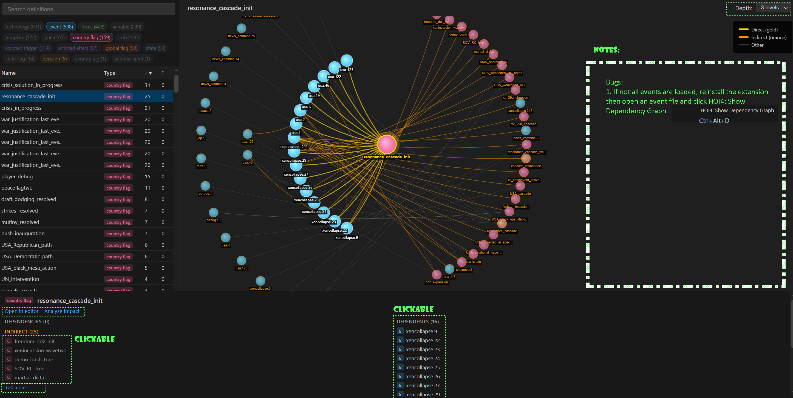
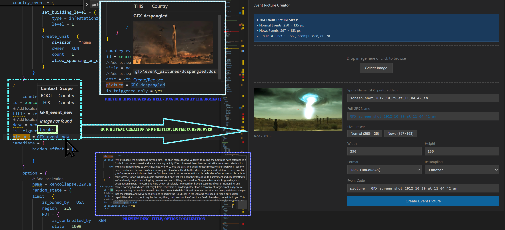
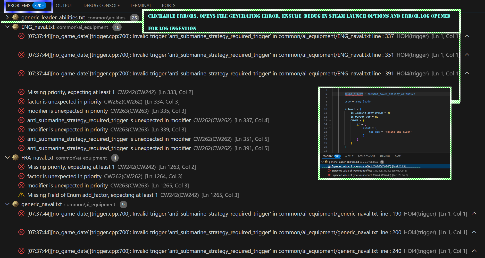
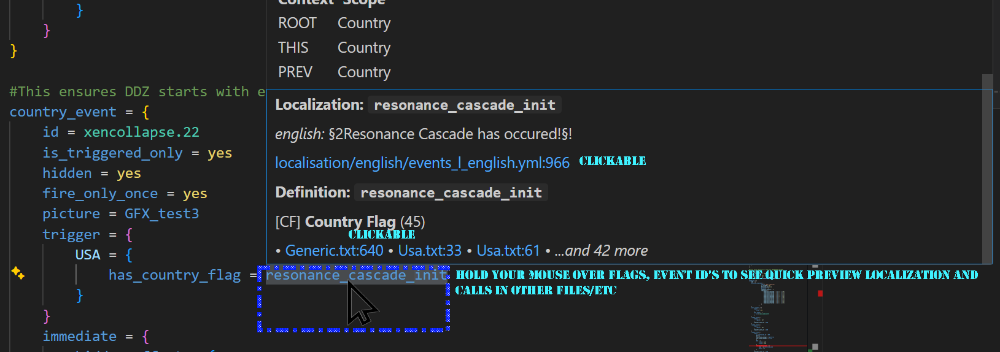

# HOI4 Modding Tools Extension

# HOI4 Modding Tools

A new Visual Studio Code extension for Hearts of Iron IV mod development, focused on ease of use, orchestration, and assisting the mod community and mod teams with a modern HOI4 modding toolset with multiple functions and uses.

## Features

### Navigation & Search
- **Global Search** - Find events, focuses, decisions, flags across all files
- **Go to Definition** - Ctrl+click on any reference to jump to its definition
- **Flag Tracker** - See where country/global flags are set and checked
- **Localization Lookup** - Hover to preview localization strings

### Visual Tools
- **Map Editor** - View provinces, states, strategic regions with multiple color modes
- **Province Picker** - Interactive mini-map for selecting locations
- **Event Picture Preview** - Hover over `picture = GFX_xxx` to see the image
- **Dependency Graph** - Visualize focus tree and event chain connections

### Code Generation
- **OOB Creator** - Build division templates, land OOBs, and air wings
- **Country Wizard** - Generate all files needed for a new country
- **Event Localizer** - Create localization entries for events

### Analysis
- **AI Behavior Analyzer** - Review AI strategy weights
- **Idea & Spirit Browser** - Browse ideas, national spirits
- **Localization Dashboard** - Track translation and missing localization keys by language
- **Performance Profiler** - Identifies potential performance issues, such as daily on_actions

### Utilities
- **Changelog Generator** - Git aware changelog with HOI4 categorization
- **Debug Log Viewer** - Parse and filter game error logs
- **Image Toolkit** - DDS/TGA preview and conversion

## Installation

1. Download the `.vsix` file from [Releases](../../releases)
2. In VS Code: `Ctrl+Shift+P` → "Extensions: Install from VSIX..."
3. Select the downloaded file
4. Reload VS Code

## Usage

Open any HOI4 mod folder in VS Code. The extension activates automatically when it detects `.txt` files or a `map/definition.csv`.

Access tools via:
- **Sidebar** - Click the shield icon in the Activity Bar
- **Command Palette** - `Ctrl+Shift+P` → type "HOI4"
- **Right-click menu** - Context actions in editor

## Requirements

- VS Code 1.85.0 or higher (or compatible Code fork)
- A HOI4 mod folder with standard structure

## Known Limitations

- Map editor is primarily for quick edits
- Dependency Graph may require a restart if events and country flags do not load
- DDS files with non-standard compression may not preview

## License

MIT

## Acknowledgments
Chaofan