# HOI4 Modding Tools for VS Code

A Visual Studio Code extension for Hearts of Iron IV mod development: visual
editors for the things that are painful to write by hand, analysers for the
things that are painful to check by hand, and a 236-tool MCP server so an AI
assistant can drive the same toolset you do.


**129 commands · 24 keybindings · 42 settings · 236 MCP tools**

---

## Scripted GUI Creator

Draw the panel, wire the buttons, press Save. The editor writes all four files a
scripted GUI actually lives in and keeps them consistent with each other.

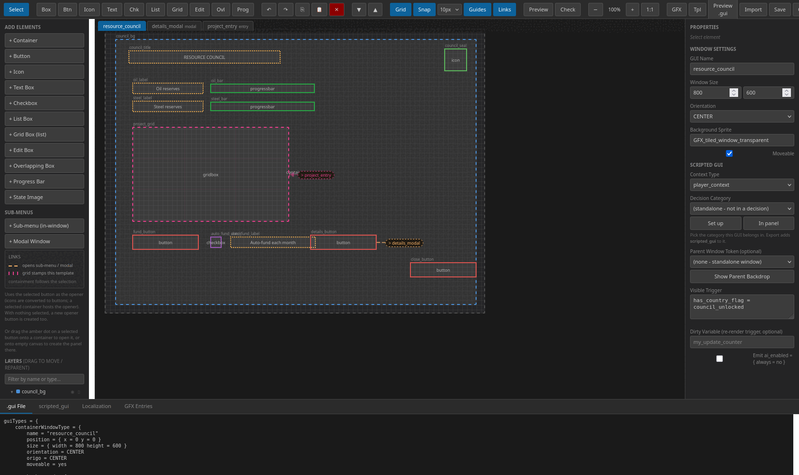

*The canvas, with window tabs across the top (main window, modal, entry
template), the element palette on the left, window and scripted-GUI settings on
the right, and the generated `.gui` updating live at the bottom.*

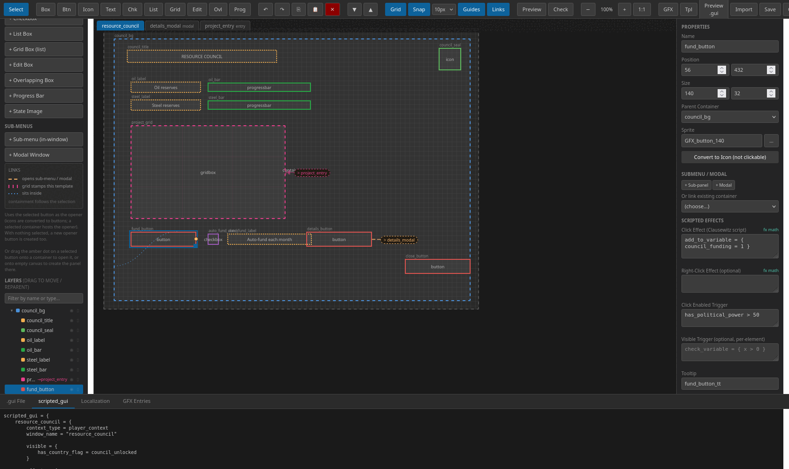

*Select an element and the right-hand panel becomes its bindings: click effect,
right-click effect, click-enabled trigger, per-element visible trigger, tooltip.
The `scripted_gui` tab at the bottom shows what those bindings compile to.*

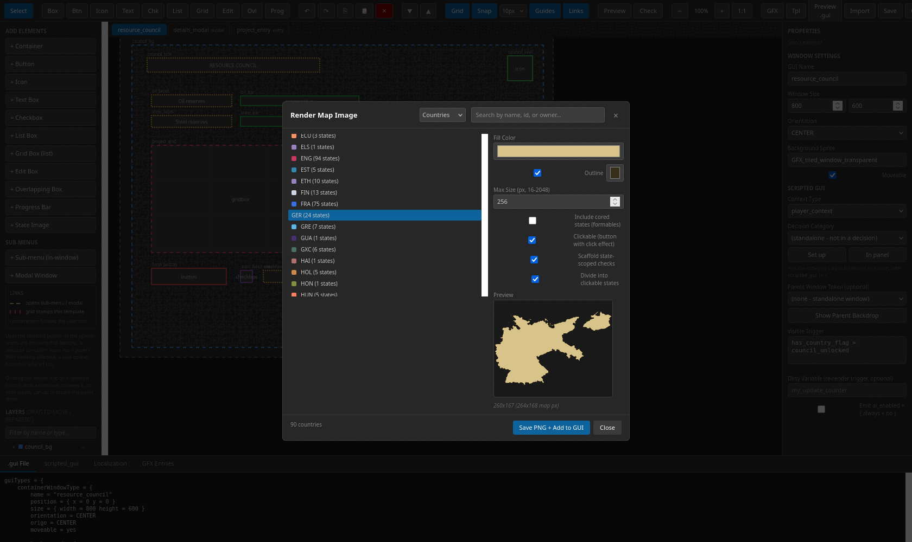

*The **Render Map Image** sub-tool turns any state, country or continent into a
sprite straight from `provinces.bmp`. Pick it from the list, set fill and
outline, and it becomes a clickable button on your canvas with the state-scoped
checks already scaffolded. (The silhouette shown is vanilla GER at 260×167, from
264×168 map pixels.)*

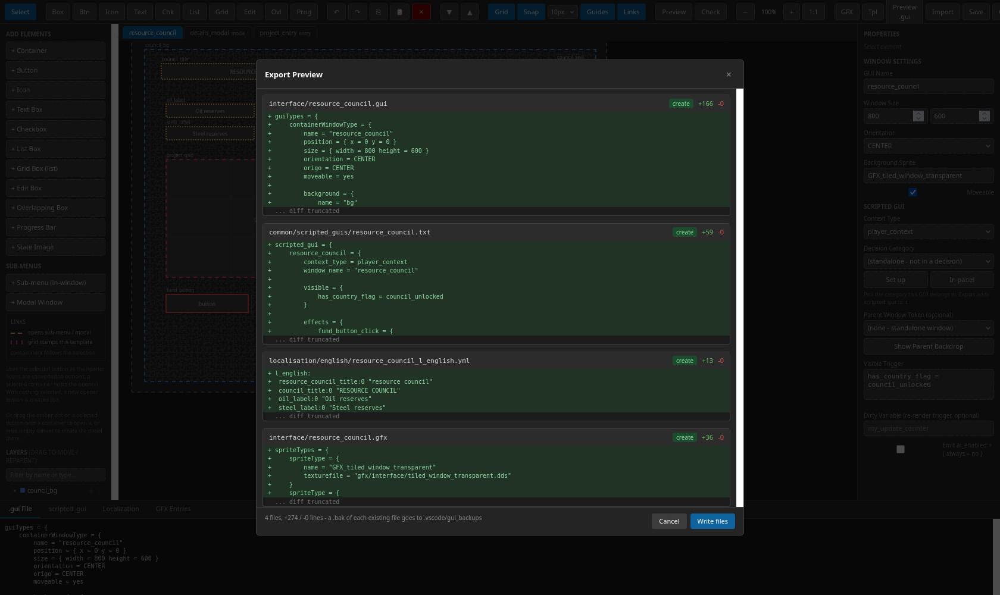

*Save shows you the diff first: the `.gui` window, the `scripted_gui` entry, the
localisation keys and the `.gfx` sprite entries, with a `.bak` of anything it
overwrites.*

---

## Other tools

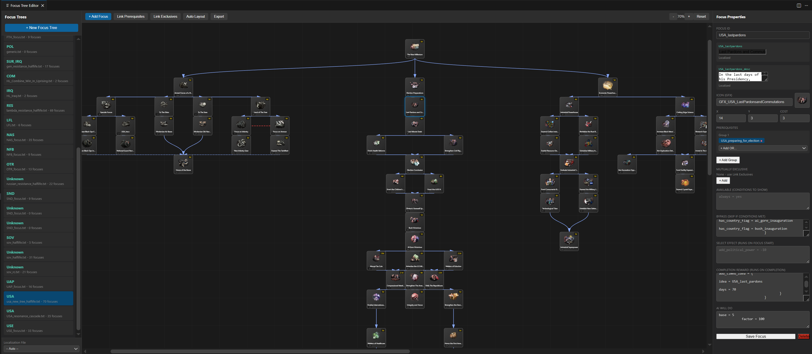

*Focus Tree Editor: drag focuses, draw prerequisites, edit properties in place.*

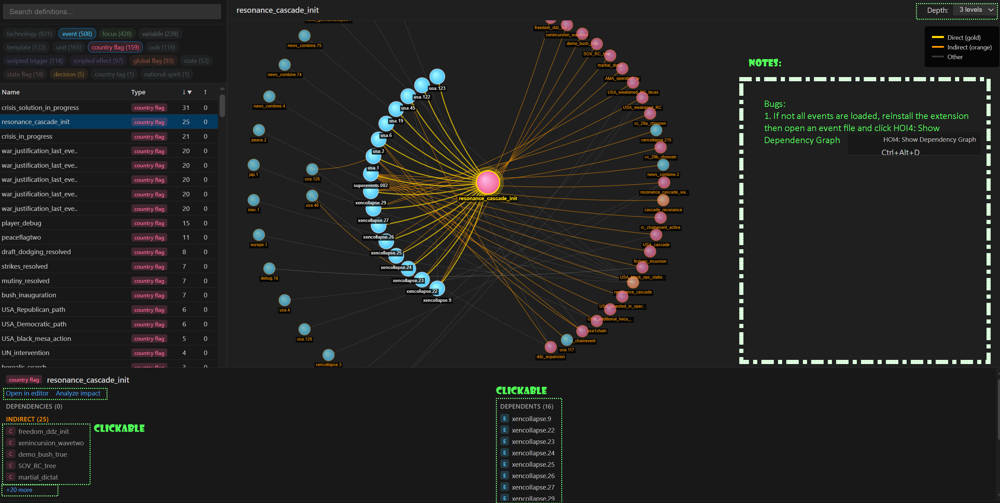

*Dependency Graph: every definition in the mod by type, what depends on a given
flag, and what breaks if you change it.*

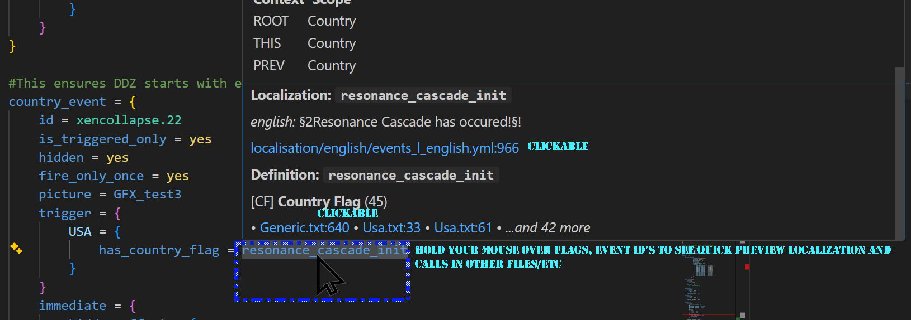

*Hover anything (a flag, an event id, a loc key) for its context scope, its
localised text and every file that references it, all click-through.*

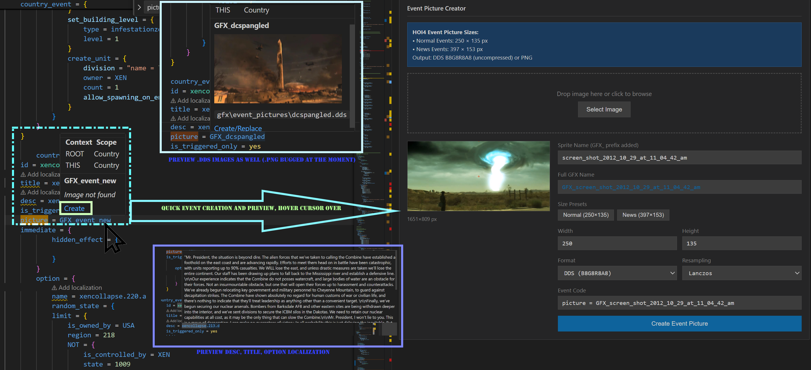

*Event Picture Creator (drop an image, get a correctly sized DDS and the
`picture = GFX_…` line) alongside inline `.dds` previews and a one-click
**Create** for a sprite the event references but nothing defines.*

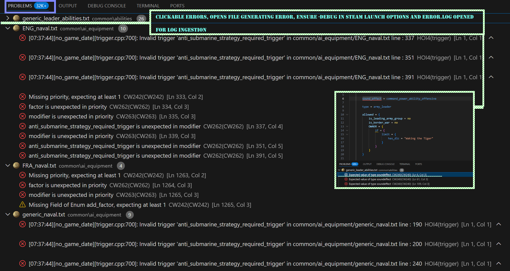

*The game's own `error.log` ingested into the Problems panel next to Clausewitz
validation, every entry click-through to the line that caused it. Launch HOI4
with `-debug` to get the log.*

---

## Table of Contents

- [Installation](#installation)
- [Quick Start](#quick-start)
- [Scripted GUI Creator: Guide](#scripted-gui-creator-guide) (how-tos)
- [Visual Editors](#visual-editors)
- [Analysis Tools](#analysis-tools)
- [Content Browsers](#content-browsers)
- [Graphics Tools](#graphics-tools)
- [Localization Tools](#localization-tools)
- [Development Tools](#development-tools)
- [Search and Navigation](#search-and-navigation)
- [Map Tools](#map-tools)
- [HOI4 Git](#hoi4-git)
- [AI Assistant Support (MCP)](#ai-assistant-support-mcp)
- [Keyboard Shortcuts](#keyboard-shortcuts)
- [Configuration](#configuration)
- [Troubleshooting](#troubleshooting)
- [Expected Mod Structure](#expected-mod-structure)
- [Contributing](#contributing)

---

## Installation

### From VSIX File (Recommended)

1. Download the latest `.vsix` from [Releases](https://github.com/OlanderIAO/HOI4-Modding-Tools-Extension-for-VSC/releases)
2. Open VS Code
3. Press `Ctrl+Shift+P` and run **Extensions: Install from VSIX**
4. Select the downloaded file
5. Reload VS Code when prompted

### From the Marketplace

Search **HOI4 Modding Tools** in the Extensions view, or install
[UC-ModdingUtilities.hoi4-modding-tools](https://marketplace.visualstudio.com/items?itemName=UC-ModdingUtilities.hoi4-modding-tools).

### Optional: ffmpeg, for animated DDS and audio tools

A few tools shell out to `ffmpeg`. On Windows, download it, copy `bin` to
`C:\ffmpeg`, and add `C:\ffmpeg\bin` to your PATH, then relaunch VS Code:

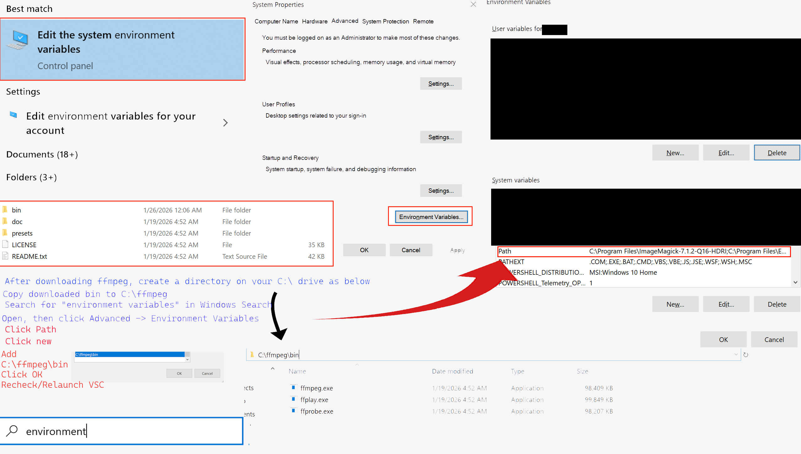

### Optional: point it at your game install

Several features read the base game: preview backdrops with real textures,
vanilla window overrides, debug log watching. Set `hoi4.gamePath` in settings to
your Hearts of Iron IV directory to enable them.

---

## Quick Start

1. **Open your mod folder** in VS Code (File → Open Folder)
2. Click the **shield icon** in the Activity Bar to reveal every tool by category
3. Start with **Welcome / Help** for an interactive guide
4. Or jump straight in: `Ctrl+Shift+P` → **HOI4: Scripted GUI Creator**

---

## Scripted GUI Creator: Guide

`Ctrl+Shift+P` → **HOI4: Scripted GUI Creator**

A scripted GUI is not one file. It is a `containerWindowType` in `interface/*.gui`,
a `scripted_gui` entry in `common/scripted_guis/*.txt` that binds its buttons to
effects, localisation keys for every label, and `.gfx` entries for every sprite:
four files that have to agree on every name, in a language where a misspelt
binding fails silently in game. The creator's job is to keep them in agreement.

### The interface

| Region | What it does |
|---|---|
| **Toolbar** | Element tools, undo/redo, clipboard, layer order, grid/snap/guides, **Links** overlay, **Preview**, **Check**, zoom, **GFX** browser, **Tpl** templates, **Import**, **Save** |
| **Window tabs** | The main window, every modal, and every entry template edit on their own canvas |
| **Add Elements** | Container, Button, Icon, Text Box, Checkbox, List Box, Grid Box, Edit Box, Overlapping Box, Progress Bar, **State Image** (opens Render Map Image) |
| **Sub-menus** | `+ Sub-menu (in-window)` and `+ Modal Window` build an opener button and its panel in one click |
| **Layers** | The element tree: drag to move or reparent, filter by name or type |
| **Properties** | Window settings and scripted-GUI settings with nothing selected; that element's bindings with something selected |
| **Code panel** | `.gui File` · `scripted_gui` · `Localization` · `GFX Entries`: the real output, updating as you edit |

### How-to: build a panel from scratch

1. **Name the window.** With nothing selected, set **GUI Name** and **Window
   Size** in Properties. That name becomes the `containerWindowType`, the
   `scripted_gui` key and the filenames.
2. **Drop a background.** `+ Container`, then set its **Sprite**, or click the
   `...` button to browse every sprite the mod and game define.
3. **Add your elements.** Click a palette entry, then click the canvas. Grid and
   Snap are on by default; the step is set by the `10px` dropdown.
4. **Parent them.** Drag elements onto a container in the **Layers** tree, or set
   **Parent Container** in Properties. Children follow a moved parent.
5. **Align.** Select several elements and use the alignment row: edges, centres,
   equal widths and heights.
6. **Check.** The **Check** button audits the whole GUI: duplicate or invalid
   names, elements outside the window, sprites defined in no `.gfx`, dynamic
   lists with no entry container, slot-size mistakes, script errors. Every
   finding is click-to-select.
7. **Save.** You get the export preview above: four files, line counts, full
   diffs. Nothing is written until you press **Write files**, and anything
   overwritten is backed up to `.vscode/gui_backups`.

### How-to: wire a button to an effect

Select the button. The Properties panel becomes its bindings:

- **Click Effect**: Clausewitz script, e.g. `add_to_variable = { council_funding = 1 }`
- **Right-Click Effect**: optional second binding
- **Click Enabled Trigger**: when the button is clickable, e.g. `has_political_power > 50`
- **Visible Trigger**: per-element visibility, independent of the window's
- **Tooltip**: a localisation key, written to the loc file for you

The creator derives the block names the game expects (`<btn>_click`,
`<btn>_click_enabled`, `<el>_visible`) so you never type a suffix. Every script
box validates as you type: unbalanced braces, unknown effect and trigger names
against a 240-entry database. It also autocompletes effect names with syntax
hints (Tab or Enter to accept).

The **fx math** link next to each effect box compiles an infix formula into
`set_variable` script through the 1.19.x math engine, so
`(oil / max_oil) * 100` becomes valid script without you writing the temp
variables by hand.

### How-to: a dynamic list

1. `+ Grid Box (list)` and place it.
2. Set **List Array** to the array the scripted GUI fills, e.g. `council_projects`.
3. Press **Create Entry Template**. You get a new canvas tab for one row.
4. Design the row. Use `[?council_projects^i]` in a text element to show the
   current entry.
5. Back on the main tab, the gridbox's **Entry Container** is already pointed at
   the template, and the template exports as its own top-level
   `containerWindowType`. Preview tiles sample rows so the list looks real
   before the game loads it.

### How-to: render a state, country or continent as a clickable image

The **+ State Image** palette entry opens **Render Map Image**, the sub-tool
that turns map geography into GUI sprites, so a "pick your region" panel does not
mean hand-tracing shapes in an image editor.

1. **Choose what you are rendering** with the dropdown: **States**,
   **Countries** or **Continents**. The list rebuilds from your mod's
   `provinces.bmp`, `definition.csv` and state files: states by id, name and
   owner; countries by tag with their state count and political colour;
   continents by index and province count. The options on the right change with
   the mode, because they are not all meaningful for every shape:

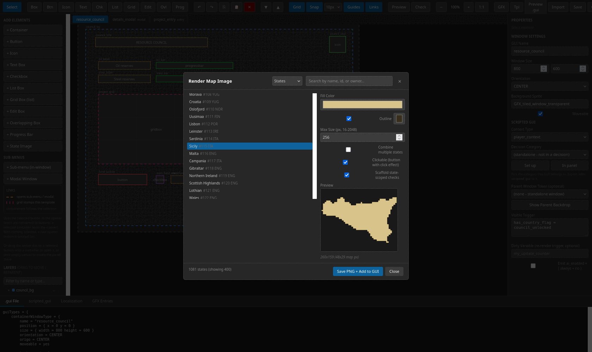

***States:*** *all 1,081 of them by name, id and owner, with* **Combine
multiple states** *offered here and nowhere else. Sicily at 260×159, from 48×29
map pixels.*

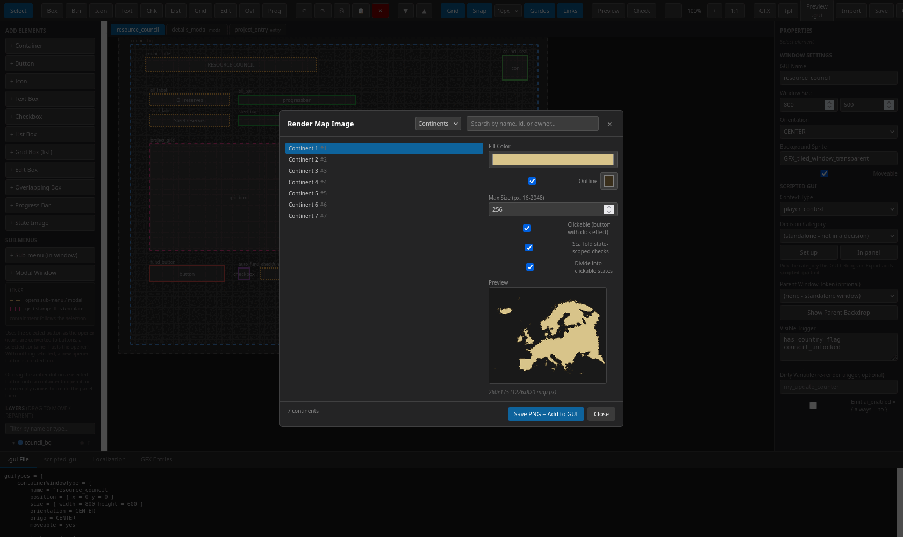

***Continents:*** *the whole landmass, with* **Divide into clickable states**
*offered for continents and countries. Europe at 260×175, from 1226×820 map
pixels. (Continents are listed by index rather than by the names in
`map/continent.txt`; see the note below.)*
2. **Find it.** The search box matches name, id or owner.
3. **Style it.** Fill colour, an optional outline with its own colour, and a max
   dimension (16–2048 px). The preview re-renders on every change, and the
   status line tells you the output size and the source size in map pixels.
4. **Options that change what gets built:**
   - **Include cored states (formables)**: countries only. Adds states merely
     *cored* by the tag, so a formable nation that owns nothing at game start
     still has a shape.
   - **Combine multiple states**: states only. Tick several and render their
     union as one shape under a region name of your choosing.
   - **Clickable**: emits a button with a click effect rather than a plain icon.
   - **Scaffold state-scoped checks**: writes the state-scope trigger boilerplate
     so the button can test what it is pointing at.
   - **Divide into clickable states**: countries and continents. Every
     constituent state becomes its own piece at one shared scale, composed back
     into the whole shape, so the map is clickable per state rather than as one
     blob.
5. **Save PNG + Add to GUI.** The image is written under `gfx/interface/`, the
   `.gfx` entry is generated, and the element lands on the canvas already wired.

> **Note on continent names.** The list shows `Continent 1` … `Continent 7`
> rather than the names in `map/continent.txt` (`europe`, `north_america`,
> `south_america`, `australia`, `africa`, `asia`, `middle_east`, in that
> order, so the index maps straight onto them). The map loader synthesises the
> labels from the continent index on each province and does not read
> `continent.txt`.

### How-to: a modal sub-window

Select the button that should open it and press **+ Modal Window** to get the
panel, the `opens_menu` wiring and its own canvas tab. Or drag the amber dot on a
selected button onto a container to make that container its target. Turn on the
**Links** overlay to see the wiring: dashed amber for *opens sub-menu / modal*,
pink for *grid stamps this template*, dotted for containment.

### How-to: attach to a vanilla window

Set **Parent Window Token** in Properties to the vanilla window you are
attaching to, then press **Show Parent Backdrop**. With `hoi4.gamePath` set, the
actual vanilla window renders behind your canvas from your install (real
decoded textures), so you position against the real UI instead of guessing.

### How-to: hook it to a decision

Set **Decision Category** in Properties and press **Set up** (a new category) or
**In panel** (an existing one). Export adds the `scripted_gui = ` line to the
category for you.

### How-to: round-trip an existing GUI

Press **Import** and pick a `.gui` file. The creator also finds the matching
`common/scripted_guis` block by `window_name` and puts everything back on the
right elements: effects, triggers, properties, dynamic lists, context type,
parent window token, visible, dirty, `ai_enabled`. Entries that match no element
are preserved and re-emitted rather than dropped.

Export writes back surgically. A same-named window is replaced **in place**
inside the existing `.gui` file (other windows, comments and headers untouched),
and the `scripted_gui` entry is replaced by name in its original file, including
across renames.

### Doing the same from an AI assistant

Everything above is also 35 `gui_*` MCP tools, so an assistant can work on your
GUI without you describing the canvas to it. The element-level ones:

| Tool | What it does |
|---|---|
| `gui_set_element` | Patch one element or many: position, size, sprite, text, parent, any binding, any raw `.gui` key via `extra` (`null` removes a key). A `set.type` on an unknown name creates it. |
| `gui_move_elements` | Move a selection by `dx/dy`, align it, distribute it with an even or fixed gap, or lay it out on a grid |
| `gui_clone_element` | Duplicate an element and its children `count` times, stepping by `dx/dy` and substituting `{i}` in names *and* cloned scripts, so one call turns a row template into rows 1..N |
| `gui_delete_element` | Remove the subtree and its `scripted_gui` blocks |
| `gui_set_effect` | Bind `click`, `right_click`, `enabled`, `visible` or `property`: derives the block name, refuses bindings the game never reads (a click effect on an `iconType`), refuses unbalanced braces |
| `gui_rename` | Rename an element with every reference to it, or a whole GUI with its window, entry, `window_name`, `<name>_title` key, decision categories and file |
| `gui_delete_gui` | Remove a GUI across all four files; defaults to `dry_run: true` |
| `gui_variables` | Audit every variable, array and flag the GUI reads or writes, and find the read with no writer anywhere, the list nobody fills, the flag checked but never set |
| `gui_override_vanilla` / `gui_diff_vanilla` | Copy a vanilla window into the mod, then report every override field-by-field and whether a patch made the game's copy newer than yours |
| `gui_make_sprite` / `gui_sprite_usage` | Write an uncompressed DDS plus its `.gfx` entry from a PNG (frame strips supported); audit sprites nothing references and textures that are missing |

These refuse only the errors *your edit introduces*, so a hand-written window
that already trips warnings can still be edited, and a refused edit leaves every
file untouched.

Details: [`docs/GUI_EDIT.md`](vsix-extracted/extension/docs/GUI_EDIT.md).

---

## Visual Editors

### Focus Tree Editor

**Command:** `HOI4: Focus Tree Editor`

A full visual editor for creating and modifying national focus trees with drag-and-drop functionality.

#### Opening the Editor

1. Click **Focus Tree Editor** in the sidebar, or
2. Press `Ctrl+Shift+P` and type "Focus Tree Editor"

#### Main Interface

- **Left Sidebar:** List of all focus trees in your mod
- **Center Canvas:** Visual focus tree with draggable nodes
- **Right Panel:** Property editor for selected focus

#### Creating a New Focus Tree

1. Click the **+ New Tree** button
2. Enter country tag (e.g., `GER`, `ENG`)
3. Enter tree name
4. Click Create

#### Adding Focuses

- Click **Add Focus** in toolbar, or
- Right-click on canvas and select "Add Focus Here", or
- Press **A** key to add at center

#### Editing Focus Properties

1. Click a focus node to select it
2. Edit properties in right panel:
   - **Focus ID:** Internal identifier
   - **Name/Description:** Click to edit localization
   - **Icon:** GFX sprite name (with preview)
   - **X/Y Position:** Grid coordinates
   - **Cost:** Days to complete
   - **Prerequisites:** Required focuses (AND groups, OR within groups)
   - **Mutually Exclusive:** Blocking focuses
   - **Available/Bypass:** Trigger conditions
   - **Completion Reward:** Effects on completion
   - **AI Will Do:** AI weighting

#### Moving Focuses

- Drag and drop focus nodes to reposition
- Position snaps to grid automatically
- Connections update in real-time

#### Linking Prerequisites

1. Click **Link Prerequisites** button or press **P**
2. Click the **parent** focus first
3. Click the **child** focus
4. Repeat for more connections
5. Press **Escape** to exit link mode

For OR prerequisites (any one required), add multiple focuses to the same prerequisite group using the dropdown in the editor.

#### Linking Mutual Exclusives

1. Click **Link Exclusives** button or press **M**
2. Click first focus
3. Click second focus
4. Both focuses will block each other

#### Focus Tree Keyboard Shortcuts

| Key | Action |
|-----|--------|
| A | Add focus at center |
| P | Toggle prerequisite linking mode |
| M | Toggle exclusive linking mode |
| Delete | Delete selected focus |
| Escape | Cancel current operation |

#### Tips

- Focus positions use HOI4's grid system (each unit = 1 column/row)
- Focuses with `relative_position_id` show calculated absolute positions
- Double-click a focus to quickly edit its name
- Use the zoom controls for large trees

---

### Decision Editor

**Command:** `HOI4: Decision Editor`

Visual editor for creating and managing decisions with full support for all decision types.

#### Decision Types Supported (Work in Progress)

- **Standard Decisions:** Instant effect on activation
- **Timed Decisions:** Effect after countdown
- **Timed Missions:** AI-triggered with timeout
- **Selectable Missions:** Player-chosen missions

#### Main Interface

- **Left Sidebar:** File browser and decision list
- **Center Panel:** Decision list with categories
- **Right Panel:** Full property editor

#### Creating Decisions from Template

1. Click **Templates** button
2. Choose a template:
   - War Goal Decision
   - Political Action
   - Timed Mission
   - Economic Decision
   - State Action
   - Faction Interaction
3. Select target category
4. Click "Create from Template"

#### Manual Creation

1. Click **+ Add** button
2. Select decision type
3. Select category
4. Edit properties in right panel

#### Editing Decisions

Select a decision to edit:

- **Basic Info:** ID, name, description, icon, category
- **Cost and Timing:** PP cost, days, re-enable delay
- **Conditions:** Allowed, Available, Visible triggers
- **Targets:** Fixed targets, target array, state targeting
- **Effects:** Complete, Remove, Timeout, Cancel effects
- **AI:** AI weighting and conditions

#### Icon Browser

1. Click **Browse...** next to Icon field
2. Search or scroll through available GFX sprites
3. Click to preview, double-click to select

#### State Picker

For `highlight_states`:

1. Click **Pick States...** button
2. Search by ID or name
3. Click states to select (multi-select)
4. Click "Apply" to insert state list

#### In-Game Preview

Click **Preview** to see how the decision appears in-game UI, including icon display, name and description, cost and duration, and category placement.

#### Validation

- Click **Validate** to check for errors
- Automatic validation on save
- Shows missing localizations, invalid references

#### Search Across Files

1. Click **Search All** button
2. Enter search term
3. Filter by type (flags, events, ideas, states)
4. Click results to jump to that decision

---

### Tech Tree Editor

**Command:** `HOI4: Tech Tree Editor`

Visual editor for technology trees with research time calculations.

#### Features

- Visual tech tree layout matching in-game view
- Drag-and-drop positioning
- Research time and cost editing
- Prerequisite linking
- Category management
- Icon preview

#### Usage

1. Select a technology file
2. Click technologies to edit properties
3. Drag to reposition
4. Link prerequisites by clicking connection mode

#### Technology Properties

- Research time and cost
- Start year
- Categories and folders
- Prerequisites
- Research bonuses
- Unlocked equipment/units

---

### Map Editor

**Command:** `HOI4: Open Map Editor`

Visual map editor for provinces, states, and strategic regions.

#### Map Layers

- **Provinces:** Individual province view
- **States:** State boundaries and ownership
- **Strategic Regions:** Military regions
- **Supply Areas:** Logistics visualization

#### Province Picker

1. Open Map Editor
2. Click on map to select province
3. Province ID shown in status bar
4. Copy ID with button or `Ctrl+C`

#### State Editing

Click state to select, then edit properties in side panel:

- Owner and controller
- Victory points
- Buildings (infrastructure, factories, etc.)
- Resources (steel, oil, etc.)
- Core states

#### Building Placement

- Click building icons to place
- Adjust levels with +/- buttons
- Visual indicators on map

---

### OOB Creator

**Command:** `HOI4: OOB Creator`

Create Orders of Battle (starting military units) for countries.

#### Creating an OOB

1. Click **New OOB** or select existing
2. Set country tag
3. Build military hierarchy

#### Unit Hierarchy

- **Theater** > Army Group > Army > Corps > Division
- Drag units to reorganize
- Right-click for context menu

#### Division Designer

1. Click **New Division**
2. Select division template or create custom
3. Add battalions: Infantry, Artillery, Armor, Support companies
4. Set equipment levels
5. Assign to army/corps

#### Air Wings

- Create air wings
- Assign aircraft types and counts
- Set home air base

#### Naval Fleets

- Create task forces
- Assign ships
- Set home port

#### Export

- Generates valid HOI4 OOB file
- Automatically creates unit history file
- Proper formatting and structure

---

## Analysis Tools

### Equipment Analyzer

**Command:** `HOI4: Equipment Analyzer`

Analyze, compare, and simulate production of equipment.

#### Equipment Browser

- Browse all equipment by category
- Filter by year, type, archetype
- View detailed stats

#### Equipment Editor

1. Select equipment to edit
2. Modify any stat
3. See combat preview update
4. Save to original file

#### Production Simulator

1. Select equipment
2. Set factory count
3. Apply modifiers (industrial capacity, production efficiency, resource availability)
4. View production rate and time estimates

#### Comparison Mode

- Select up to 3 equipment items
- Side-by-side stat comparison
- Highlights best/worst values
- Cost efficiency analysis

---

### Battle Simulator

**Command:** `HOI4: Battle Simulator`

Simulate combat between divisions to test effectiveness.

#### Setting Up a Battle

1. **Attacker:** Build or select division
2. **Defender:** Build or select division
3. **Terrain:** Select combat terrain
4. **Modifiers:** Add entrenchment, air support, etc.

#### Division Builder

- Add any unit types
- Set equipment variants
- Apply doctrines and modifiers

#### Combat Stats

- Soft/Hard Attack values
- Defense and Breakthrough
- Organization and HP
- Armor and Piercing

#### Simulation Results

- Predicted winner
- Estimated battle duration
- Casualty estimates
- Organization damage over time

---

### AI Behavior Viewer

**Command:** `HOI4: AI Behavior`

Analyze and understand AI decision-making in your mod.

#### Features

- View AI strategy plans
- Analyze focus tree AI weights
- See decision AI priorities
- Understand AI division templates

#### Usage

1. Select country or AI file
2. Browse AI behaviors by type
3. View conditions and weights
4. Identify potential issues

---

### Event Chain Visualizer

**Command:** `HOI4: Event Chain Visualizer`

Visualize event relationships and chains.

#### Features

- Interactive graph view
- Automatic chain detection
- Option tracking
- Namespace filtering

#### Usage

1. Open Event Chain Visualizer
2. Select event namespace or file
3. View connected events as graph
4. Click nodes to see event details
5. Follow option arrows to see triggers

#### Graph Controls

- Zoom with scroll wheel
- Pan by dragging background
- Click nodes to select
- Double-click to open event file

---

### Dependency Graph

**Command:** `HOI4: Show Dependency Graph`

**Shortcut:** `Ctrl+Alt+D`

Visualize relationships between files in your mod.

#### Features

- File dependency visualization
- Circular dependency detection
- Impact analysis
- Filter by file type

#### Usage

1. Open from sidebar or command
2. Select root file or view all
3. Explore connections
4. Click nodes to see details

#### Impact Analysis

Right-click any file and select "Analyze Impact" to see:

- What files depend on this file
- What this file depends on
- Potential cascade effects of changes

---

## Content Browsers

### Idea Browser

**Command:** `HOI4: Idea Browser`

Browse and search all ideas, national spirits, and advisors.

#### Categories

- National Spirits
- Political Advisors
- Military Advisors (Army, Navy, Air)
- Theorists
- Laws (Economy, Trade, Conscription)
- Hidden Ideas

#### Features

- Search by name or effect
- Filter by category
- View all modifiers
- See availability conditions
- Cost information

#### Usage

1. Open Idea Browser
2. Select category or search
3. Click idea to see details
4. Double-click to open source file

---

### Flag and Variable Tracker

**Command:** `HOI4: Flag Tracker`

Track global flags, country flags, and variables across your mod.

#### Features

- Find all flag/variable definitions
- Track where flags are set
- Track where flags are checked
- Identify unused flags

#### Flag Types

- Global flags
- Country flags
- State flags
- Variables
- Dynamic modifiers

#### Usage

1. Open Flag Tracker
2. Search for flag name
3. View all references
4. Click to jump to location

---

## Graphics Tools

### GFX Auditor

**Command:** `HOI4: GFX Auditor`

Validate and manage graphical assets.

#### Audit Types

- **Missing Assets:** GFX defined but file missing
- **Unused Assets:** Files with no GFX reference
- **Invalid Dimensions:** Wrong image sizes
- **Format Issues:** Incorrect file formats

#### Usage

1. Open GFX Auditor
2. Run audit (automatic on open)
3. Review issues by category
4. Click to navigate to problem
5. Use Quick Fix for common issues

#### Quick Fixes

- Generate missing GFX entries
- Create placeholder images
- Fix path references

---

### Image Toolkit

**Command:** `HOI4: Image Toolkit`

Image processing and conversion tools.

#### Features

- View DDS files directly
- Convert between formats (DDS, PNG, TGA)
- Resize images
- Generate mipmaps
- Batch processing

#### Supported Formats

- DDS (DXT1, DXT5, BC7)
- PNG
- TGA
- BMP

---

### Event Picture Creator

**Command:** `HOI4: Event Picture Creator`

Create and manage event pictures.

#### Features

- Browse existing event pictures
- Create new event GFX entries
- Preview at correct dimensions
- Auto-generate sprite definitions

#### Usage

1. Open Event Picture Creator
2. Browse or create new
3. Select source image
4. Set GFX name
5. Generate entry and copy files

---

### Animated DDS Viewer

**Command:** `HOI4: Animated DDS`

View animated DDS files used in HOI4.

#### Features

- Play animated textures
- Frame-by-frame view
- Speed controls
- Export frames

---

## Localization Tools

### Localization Dashboard

**Command:** `HOI4: Localization Dashboard`

**Shortcut:** `Ctrl+Alt+L`

Overview of localization coverage and management.

#### Features

- Coverage statistics by category
- Missing key detection
- Language comparison
- Batch operations

#### Dashboard Views

- **Overview:** Total coverage percentage
- **By File:** Coverage per localization file
- **Missing:** List of unlocalized keys
- **Comparison:** Compare languages

#### Batch Operations

- Add multiple keys at once
- Copy from one language to another
- Export missing keys list

---

### Event Localizer

**Command:** `HOI4: Event Localizer`

Quickly localize events with assisted suggestions.

#### Features

- Event-focused localization
- Title and description editing
- Option text management
- Preview formatted text

#### Usage

1. Open Event Localizer
2. Select event file
3. Edit titles, descriptions, options
4. Save to localization file

---

### Quick Localize

**Shortcut:** `Ctrl+Shift+L`

Instantly add localization for selected text.

#### Usage

1. Select a localization key in your code (e.g., `my_event.1.t`)
2. Press `Ctrl+Shift+L`
3. Enter the localized text
4. Automatically added to your localization file

#### Configuration

Set your default localization file in settings:

```json
{
  "hoi4.localizationFile": "localisation/mymod_l_english.yml"
}
```

---

## Development Tools

### Dev Notes and Kanban

**Command:** `HOI4: Dev Notes`

Project management integrated into your mod workspace.

#### Kanban Board

- Drag-and-drop task management
- Customizable columns
- Card labels and due dates
- Rich text descriptions

#### File Notes

- Attach notes to specific files
- Quick access from explorer
- Color-coded by priority

#### TODO Scanner

Automatically finds comments:

- `// TODO: ...`
- `// FIXME: ...`
- `// NOTE: ...`
- `# ISSUE: ...`

#### Data Storage

- Saved to `.hoi4-dev-notes.json`
- Add to `.gitignore` if desired
- Share via version control

---

### Performance Profiler

**Command:** `HOI4: Performance Profiler`

**Shortcut:** `Ctrl+Alt+P`

Analyze mod performance and find bottlenecks.

#### Metrics Analyzed

- File size analysis
- Trigger complexity scoring
- Effect chain depth
- Event fire frequency estimates

#### Reports

- **Large Files:** Files that may cause loading issues
- **Complex Triggers:** Expensive condition checks
- **Heavy Effects:** Resource-intensive effects
- **Recommendations:** Optimization suggestions

#### Usage

1. Open Performance Profiler
2. Run analysis
3. Review issues by severity
4. Click items to navigate
5. Follow recommendations

---

### Debug Log Viewer

**Command:** `HOI4: Show Debug Log`

**Shortcut:** `Ctrl+Alt+O`

View and analyze HOI4's debug output.

#### Features

- Live log tailing
- Error highlighting (red)
- Warning highlighting (yellow)
- Filter by type
- Search functionality
- Click errors to open source

#### Log Watcher

Start continuous monitoring:

1. `HOI4: Start Debug Log Watcher`
2. Run the game
3. Errors appear in real-time
4. `HOI4: Stop Debug Log Watcher` when done

#### Configuration

Set your log path:

```json
{
  "hoi4.debugLogPath": "C:/Users/You/Documents/Paradox Interactive/Hearts of Iron IV/logs"
}
```

---

### Changelog Generator

**Command:** `HOI4: Changelog Generator`

Generate changelogs from git history.

#### Features

- Reads git commits automatically
- Auto-categorizes changes
- Version tagging
- Markdown export
- Custom templates

#### Categories

- Features
- Bug Fixes
- Balance Changes
- Content Additions
- Performance

#### Usage

1. Open Changelog Generator
2. Select date range or version tags
3. Review and edit entries
4. Export as Markdown
5. Ready for Steam/GitHub

---

## Search and Navigation

### Global Search

**Command:** `HOI4: Global Search`

**Shortcut:** `Ctrl+Alt+G`

Search across all mod content.

### Specialized Searches

| Command | Shortcut | Searches |
|---------|----------|----------|
| Search Flags | `Ctrl+Shift+F` | Country flags, global flags |
| Search Events | - | Event IDs and content |
| Search Focus | - | Focus tree IDs and effects |
| Search Decisions | - | Decision IDs and triggers |

### Go to Definition

**Shortcut:** `F12`

Jump to the definition of event IDs, focus IDs, decision IDs, idea IDs, and technology IDs.

### Find All References

**Shortcut:** `Shift+F12`

Find everywhere something is used.	

---

## Map Tools

78 map tools, all operating on the mod's real files (`provinces.bmp`,
`definition.csv`, `heightmap.bmp`, the state and strategic-region files), with a
backup before every write and a `dry_run` on anything destructive.

### Making a map

Paint a province and make it playable: `map_create_provinces` and
`map_create_province_chain` mint ids, colours and definition rows; `map_paint`
edits the bitmap with an erase guard so a province can never be silently
deleted; `map_auto_states` and `map_auto_regions` group provinces; and
`map_generate_positions`, `map_generate_unitstacks`, `map_generate_buildings`,
`map_generate_railways`, `map_generate_adjacencies` and
`map_generate_world_normal` produce everything downstream of the raster.

### Reshaping one

- **Provinces**: `map_split_province`, `map_merge_provinces`, `map_grow_province`,
  `map_move_border`, `map_reshape_province`, `map_fix_contiguity`
- **States**: `map_split_state`, `map_merge_states`, `map_grow_state`,
  `map_rebalance_states`
- **Locations**: `map_move_location` and `map_relocate_after_edit` for anchors,
  airports and rocket sites
- **Canvas**: `map_resize_canvas` (extend or crop, coordinates shifted),
  `map_scale` (one uniform factor), `map_stretch` (independent x and y, with
  `preserve_area` to change the aspect ratio at constant pixel count)

### Reprojecting one

`map_reproject` warps every bitmap layer *and* every pixel coordinate in
adjacencies, positions, buildings and unitstacks from one cylindrical projection
to another: Miller, equirectangular, Mercator, Web Mercator, Gall stereographic,
central cylindrical, and four cylindrical equal-area variants. Nearest-neighbour
on provinces and indexed layers so colours and palettes survive, bilinear on the
heightmap, each layer at its own resolution. About 345 ms for all seven layers of
a 5632×2048 map.

`map_fit_projection` tells you what your map already is: give it four or more
control points with real lat/lon and it least-squares-fits every candidate. It
is honest about what it cannot resolve: every cylindrical projection puts x
linear in longitude, and the four equal-area variants are the same curve up to a
constant, so it reports a *family* rather than inventing a winner.

### Sea and naval

`map_ocean_check`, `map_place_ports`, `map_auto_naval_terrain`,
`map_shape_seabed`, `map_tile_ocean`, `map_make_lakes`, `map_add_canal`,
`map_naval_reach`.

Details: [`docs/MAP_MAKING.md`](vsix-extracted/extension/docs/MAP_MAKING.md),
[`MAP_RASTER.md`](vsix-extracted/extension/docs/MAP_RASTER.md),
[`MAP_RESIZE.md`](vsix-extracted/extension/docs/MAP_RESIZE.md),
[`MAP_SEA.md`](vsix-extracted/extension/docs/MAP_SEA.md),
[`MAP_PROJECTION.md`](vsix-extracted/extension/docs/MAP_PROJECTION.md).

---

## HOI4 Git

**HOI4 Git: Open** (`Ctrl+Alt+G`) is a source-control workbench built for mod
teams, so nobody has to explain a 4,000-line `states` diff in a Discord thread.

**Desktop parity.** Changes with per-file, per-hunk *and per-line* staging,
commit box with amend / sign-off / co-authors, History with a lane graph,
branches, stashes, tags, remotes, fetch/pull/push, clone, `.gitignore` template.

**Beyond it.** GitHub sign-in through VS Code (PRs, issues, check runs, Actions),
an interactive rebase editor you drag to reorder, reflog undo, a bisect stepper,
worktrees, submodules, Git LFS tracking for `.dds/.tga/.ogg`, publish repository.

**HOI4-specific.** Semantic diffs that read like the change you actually made:
`owner GER → POL`, `+focus POL_c`, `moved (1,1)→(3,1)`, `~key: "A" → "B"`, for
states, focus trees, events, decisions, ideas, country history, localisation,
sprites and images. A **File Graph** tab showing files as nodes and HOI4
references as edges, so you can stage a whole feature cluster. A validation gate
before commit: braces, BOM, conflict markers, missing loc keys, unknown focus
prerequisites, state sanity, upside-down flags. **Structural 3-way merge** of
Clausewitz files by block, installable as a git merge driver. "Blame mod object"
for a state, focus, event or loc key. And a one-click **release**: descriptor
version bump → commit → tag → zip → optional GitHub release and push.

**The diff viewer** does word-level diffing tuned for Clausewitz tokens
(`add_core_of={GER}` splits on the braces and the operator), side-by-side view,
folded runs of unchanged lines, a filter box over paths and semantic summaries,
and keyboard navigation (`j`/`k` files, `s` stage, `u` unstage, `o` open,
`t` tree, `v` split, `/` filter).

Design of record: [`docs/GIT_PLAN.md`](vsix-extracted/extension/docs/GIT_PLAN.md).

---

## AI Assistant Support (MCP)

The extension ships an MCP server exposing **236 tools** over stdio, so an AI
assistant works on your mod through the same code paths the panels use, not by
guessing at file formats.

| Family | Tools | What it covers |
|---|---:|---|
| `git_*` | 84 | Every HOI4 Git panel operation, generated from one operation table |
| `map_*` | 78 | Rasters, map-making, sea, resize, reprojection |
| `gui_*` | 35 | Scripted GUI read, write, element edits, sprites, vanilla overrides |
| `script_*` | 20 | Structured Clausewitz editing: select and patch nodes, no throwaway regex |
| `loc_*` | 6 | Read, search, validate and write localisation |
| `focus_*` | 6 | Focus tree reading and editing |
| `event_*` | 4 | Event reading and editing |
| `mod_*`, `game_*` | 3 | Mod structure, file access, game log analysis |

Every family can be switched off with an environment variable
(`HOI4_MCP_GIT_TOOLS=0`, `HOI4_MCP_MAP_*`, `HOI4_MCP_GUI_EDIT_TOOLS=0`,
`HOI4_MCP_PROJECT_TOOLS=0` and so on) if you want a smaller tool surface.

**Structured script editing** deserves a mention on its own. `script_*` tools
parse Clausewitz properly and edit by selector (`state/history/buildings/1234`),
so an assistant changes the node you meant and leaves the file's comments,
formatting and sibling blocks alone. See
[`docs/SCRIPT_EDIT.md`](vsix-extracted/extension/docs/SCRIPT_EDIT.md).

**Safety.** Destructive tools take `dry_run`, write a backup first, and return
`{error}` rather than throwing: a refused operation writes nothing.

---

## Keyboard Shortcuts

| Shortcut | Action |
|----------|--------|
| `Ctrl+Shift+L` | Quick Localize selected text | (Or select text and right click and click HOI4: Add Dev Note Here)
| `Ctrl+Alt+G` | Global Search |
| `Ctrl+Alt+D` | Dependency Graph |
| `Ctrl+Alt+P` | Performance Profiler |
| `Ctrl+Alt+L` | Localization Dashboard |
| `Ctrl+Alt+O` | Debug Log Viewer | Or click Problems by Output on the bottom menu pane
| `Ctrl+Shift+I` | Analyze Impact |
| `F12` | Go to Definition |
| `Shift+F12` | Find All References |
| `Ctrl+Space` | IntelliSense suggestions |
| `Ctrl+.` | Quick Fix menu |

---

## Configuration

### Extension Settings

Access via **File > Preferences > Settings** and search for "HOI4" or edit the Extension Settings Workspace.

```json
{
  "hoi4.gamePath": "C:/Program Files/Steam/steamapps/common/Hearts of Iron IV",
  "hoi4.defaultLanguage": "english",
  "hoi4.localizationFile": "localisation/mymod_l_english.yml",
  "hoi4.enableDiagnostics": true,
  "hoi4.debugLogPath": "Documents/Paradox Interactive/Hearts of Iron IV/logs"
}
```

### Workspace Settings

Create `.vscode/settings.json` in your mod folder for project-specific settings:

```json
{
  "hoi4.modName": "My Awesome Mod",
  "hoi4.modVersion": "1.0.0",
  "hoi4.supportedGameVersion": "1.14.*"
}
```

---

## Troubleshooting

### Extension Not Loading

1. Ensure you opened a **folder**, not individual files
2. Check for `descriptor.mod` in root (identifies HOI4 mod)
3. Reload VS Code: `Ctrl+Shift+P` > "Reload Window"
4. Check Output panel for errors: View > Output > "HOI4 Modding Tools"

### Map Editor Issues

- Verify `map/definition.csv` exists
- Ensure `map/provinces.bmp` is valid
- Check file permissions

### Localization Not Working

1. Set localization file in settings
2. Ensure file uses **UTF-8-BOM** encoding
3. Verify file path is correct relative to workspace

### Focus Tree Not Displaying Correctly

- Check for circular `relative_position_id` references
- Verify all referenced focuses exist
- Save and reload the tree

### Performance Issues

1. Large mods take time to index on first open
2. Close unused editor panels
3. Disable unused features in settings
4. Rebuild index: `HOI4: Rebuild File Index`

---

## Expected Mod Structure

```
your-mod/
├── common/
│   ├── countries/
│   ├── country_tags/
│   ├── decisions/
│   │   └── categories/
│   ├── ideas/
│   ├── national_focus/
│   ├── technologies/
│   └── units/
│       └── equipment/
├── events/
├── gfx/
│   ├── event_pictures/
│   ├── interface/
│   │   └── goals/
│   └── leaders/
├── history/
│   ├── countries/
│   ├── states/
│   └── units/
├── interface/
├── localisation/
├── map/
│   ├── definition.csv
│   └── provinces.bmp
└── descriptor.mod
```

---

## Contributing

Issues and pull requests are welcome at
[OlanderIAO/HOI4-Modding-Tools-Extension-for-VSC](https://github.com/OlanderIAO/HOI4-Modding-Tools-Extension-for-VSC).

### Reporting Issues

1. [Open a GitHub issue](https://github.com/OlanderIAO/HOI4-Modding-Tools-Extension-for-VSC/issues/new),
   or
2. Message **awesome___.** (Olander) on Discord

Include your extension version (the badge above is the current release), your VS
Code version, and the mod folder layout if the problem is file-related.

---

## Acknowledgments

- Hearts of Iron IV by Paradox Interactive
- VS Code Extension API
- The HOI4 modding community
- Chaofan
---

## Support

- **Issues:** [GitHub Issues](https://github.com/OlanderIAO/HOI4-Modding-Tools-Extension-for-VSC/issues)
- **Discussions:** [GitHub Discussions](https://github.com/OlanderIAO/HOI4-Modding-Tools-Extension-for-VSC/discussions)

---